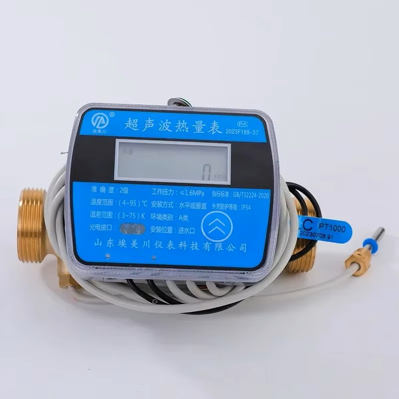
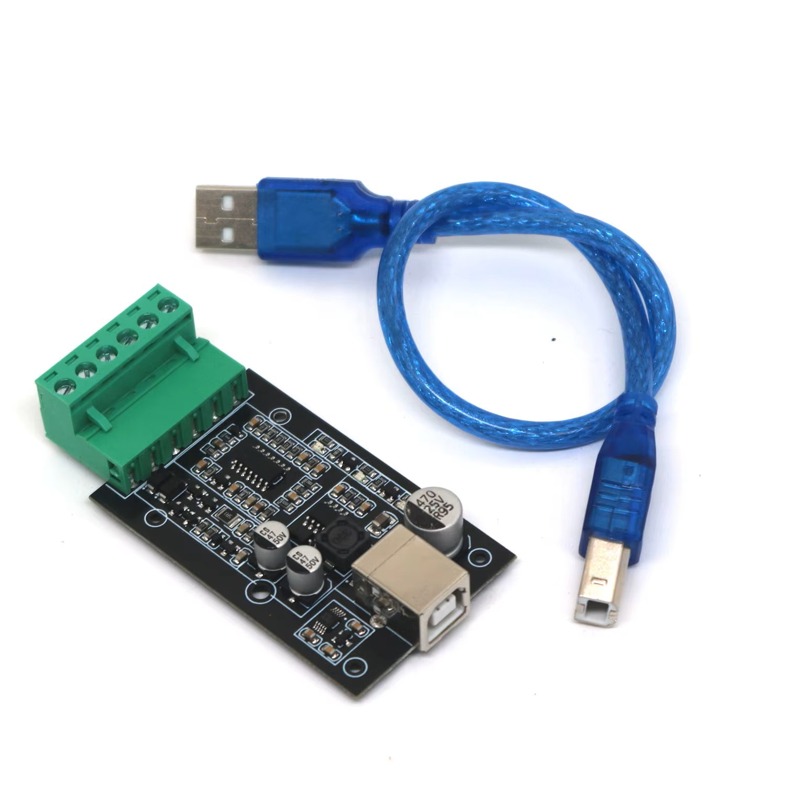

# domoticz-chinese-heat-meter-plugin
## Description
Chinese Heat Ultrasonic Meter with MBUS interface Domoticz plugin.



The device returns more values than it's used in Domoticz plugin.
The rest is considered as unused. The frame format was discovered
based on manucaturer chinese documenatation and revers engineering.

## Hardware and wiring
Tested with chinese USB to MBUS master module.


## Installation
```
cd ~/domoticz/plugins
pip install -r requirements.txt
git clone https://github.com/pawelmuszynski/domoticz-chinese-heat-meter-plugin.git
```
Restart your Domoticz server.

## Used modules
- pyserial 3.5

Tested with Domoticz 2024.7.

# Details

## Data frame format

reponse byte 0: 68 <= start byte\
\
reponse byte 1: 20 <= device type: heat meter\
\
reponse byte 2: 36 <= 7-byte device address\
reponse byte 3: 67\
reponse byte 4: 33\
reponse byte 5: 23\
reponse byte 6: 00\
reponse byte 7: 00\
reponse byte 8: 00\
\
reponse byte 9: 81\
\
reponse byte 10: 2e <= data length\
\
reponse byte 11: 1f\
reponse byte 12: 90\
reponse byte 13: 00\
\
reponse byte 14: 00 <= cooling energy (4 BCD bytes + 1 byte unit indicator)\
reponse byte 15: 00\
reponse byte 16: 00\
reponse byte 17: 00\
reponse byte 18: 05 <= kWh\
\
reponse byte 19: 00 <== heating energy (4 BCD bytes + 1 byte unit indicator)\
reponse byte 20: 00\
reponse byte 21: 00\
reponse byte 22: 00\
reponse byte 23: 05 <= kWh\
\
reponse byte 24: 00 <== heat power (4 BCD bytes + 1 byte unit indicator)\
reponse byte 25: 00\
reponse byte 26: 00\
reponse byte 27: 00\
reponse byte 28: 17 <= kW\
\
reponse byte 29: 00 <== flow rate (4 BCD bytes + 1 byte unit indicator)\
reponse byte 30: 00\
reponse byte 31: 00\
reponse byte 32: 00\
reponse byte 33: 35 <= m³/h\
\
reponse byte 34: 00 <== cumulative flow (4 BCD bytes + 1 byte unit indicator)\
reponse byte 35: 00\
reponse byte 36: 00\
reponse byte 37: 00\
reponse byte 38: 2c <= m³\
\
reponse byte 39: 13 <= heating temperature (3 BCD bytes) (24.13 ℃)\
reponse byte 40: 24\
reponse byte 41: 00\
\
reponse byte 42: 29 <= return temperature (3 BCD bytes) (23.29 ℃)\
reponse byte 43: 23\
reponse byte 44: 00\
\
reponse byte 45: 21 <= working hours (3 BCD bytes) (2321 h)\
reponse byte 46: 23\
reponse byte 47: 00\
\
reponse byte 48: 32 <= real time (7 BCD bytes)\
reponse byte 49: 10\
reponse byte 50: 20\
reponse byte 51: 11\
reponse byte 52: 09\
reponse byte 53: 20\
reponse byte 54: 20\
\
reponse byte 55: 08 <= status (2 bytes)\
reponse byte 56: 00\
\
reponse byte 57: e6 <= CS byte\
reponse byte 58: 16 <= END byte
